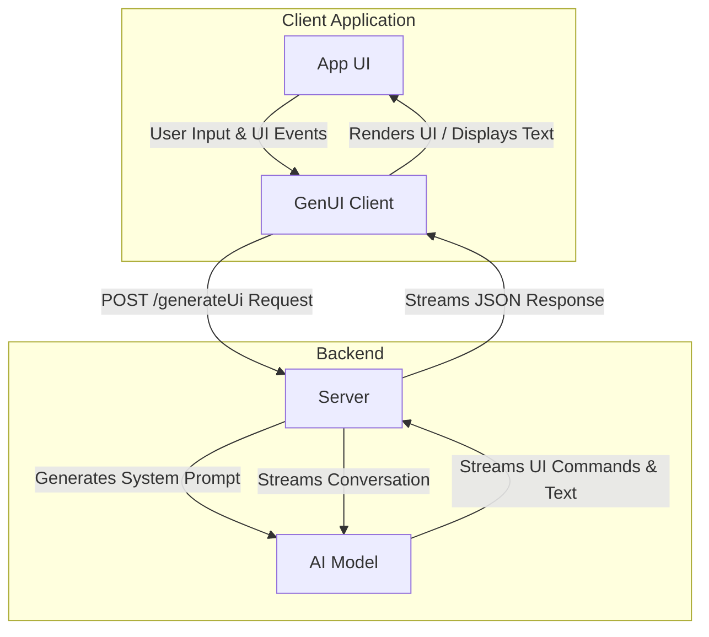
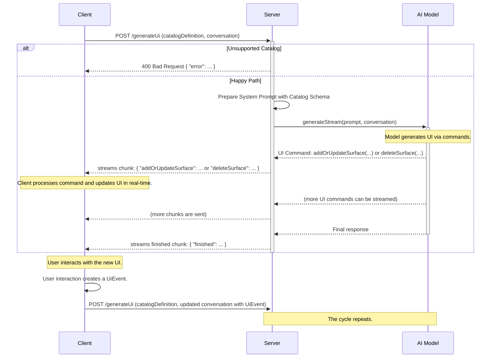

# GenUI Client-Server Communication Protocol v1.0

This document outlines the JSON-based wire format for **v1.0** of the GenUI protocol. The protocol is designed to facilitate real-time, AI-driven user interface generation over a streaming HTTP connection.

## Architecture Overview

The communication model involves a client application, a server that orchestrates AI interactions, and an AI model that generates UI definitions and text responses from a given catalog of client-available widgets.



## Communication Flow

The interaction is stateful on the client and stateless on the server. The client maintains the full conversation history and sends it, along with the client-available catalog with every request. The server processes the request, interacts with the AI model, and streams back responses. The client can refer to a predefined catalog and version that it supports, and augment that catalog with local widgets.



## Endpoint: `POST /generateUi`

This is the sole endpoint for all communication.

- **URL**: `/generateUi`
- **Method**: `POST`
- **Query Parameters**:
  - `stream=true`: (Required) Indicates that the client expects a streaming response.
- **Content-Type**: `application/json`

---

## Request Body Format

The body of the `POST` request is a JSON object containing the client's UI capabilities and the complete conversation history.

### Top-Level Request Schema

```json
{
  "$schema": "https://json-schema.org/draft/2020-12/schema#",
  "type": "object",
  "properties": {
    "catalogDefinition": {
      "description": "Defines the protocol version and the UI widget catalog to be used.",
      "$ref": "#/definitions/CatalogDefinition"
    },
    "conversation": {
      "description": "An array of messages representing the conversation history.",
      "type": "array",
      "items": {
        "$ref": "#/definitions/GenuiClientMessage"
      }
    }
  },
  "required": ["catalogDefinition", "conversation"],
  "definitions": {
    "CatalogDefinition": {
        "type": "object",
        "properties": {
            "protocolVersion": {
                "description": "The version of the GenUI protocol being used.",
                "type": "string",
                "const": "1.0"
            },
            "baseCatalog": {
                "description": "A reference to a predefined, versioned catalog on the server.",
                "type": "object",
                "properties": {
                    "name": {
                        "description": "The name of the base catalog. For v1.0, only 'default' is supported.",
                        "type": "string"
                    },
                    "version": {
                        "description": "The version of the base catalog.",
                        "type": "string"
                    }
                },
                "required": ["name", "version"]
            },
            "augmentations": {
                "description": "A list of custom widget definitions that augment the base catalog.",
                "type": "array",
                "items": {
                    "$ref": "#/definitions/WidgetDefinition"
                }
            }
        },
        "required": ["protocolVersion"]
    },
    "WidgetDefinition": {
        "type": "object",
        "properties": {
            "name": {
                "description": "The name of the widget (e.g., 'MyCustomCard').",
                "type": "string"
            },
            "description": {
                "description": "A description of what the widget is and does.",
                "type": "string"
            },
            "properties": {
                "description": "A list of properties that this widget accepts.",
                "type": "array",
                "items": {
                    "$ref": "#/definitions/PropertyDefinition"
                }
            }
        },
        "required": ["name", "description", "properties"]
    },
    "PropertyDefinition": {
        "type": "object",
        "properties": {
            "name": {
                "description": "The name of the property (e.g., 'title', 'onTap').",
                "type": "string"
            },
            "description": {
                "description": "A description of what the property does.",
                "type": "string"
            },
            "isRequired": {
                "description": "Whether this property is required.",
                "type": "boolean"
            },
            "type": {
                "description": "The data type of the property.",
                "type": "string",
                "enum": ["string", "number", "boolean", "eventHandler", "widgetId", "listOfWidgetId"]
            }
        },
        "required": ["name", "description", "isRequired", "type"]
    },
    "GenuiClientMessage": {
      "type": "object",
      "properties": {
        "role": {
          "type": "string",
          "enum": ["user", "model"]
        },
        "parts": {
          "type": "array",
          "items": {
            "$ref": "#/definitions/MessagePart"
          }
        }
      },
      "required": ["role", "parts"]
    },
    "MessagePart": {
      "oneOf": [
        { "$ref": "#/definitions/TextPart" },
        { "$ref": "#/definitions/ImagePart" },
        { "$ref": "#/definitions/UiPart" },
        { "$ref": "#/definitions/UiEventPart" }
      ]
    },
    "TextPart": {
      "type": "object",
      "properties": {
        "type": { "const": "text" },
        "text": { "type": "string" }
      },
      "required": ["type", "text"]
    },
    "ImagePart": {
      "type": "object",
      "properties": {
        "type": { "const": "image" },
        "base64": { "type": "string" },
        "mimeType": { "type": "string" },
        "url": { "type": "string", "format": "uri" }
      },
      "required": ["type"]
    },
    "UiPart": {
      "type": "object",
      "properties": {
        "type": { "const": "ui" },
        "definition": { "$ref": "#/definitions/UiDefinition" }
      },
      "required": ["type", "definition"]
    },
    "UiEventPart": {
      "type": "object",
      "properties": {
        "type": { "const": "uiEvent" },
        "event": { "$ref": "#/definitions/UiEvent" }
      },
      "required": ["type", "event"]
    },
    "UiEvent": {
      "type": "object",
      "properties": {
        "surfaceId": { "type": "string" },
        "widgetId": { "type": "string" },
        "eventType": { "type": "string" },
        "eventId": { "type": "string" },
        "isAction": { "type": "boolean" },
        "value": {},
        "timestamp": { "type": "string", "format": "date-time" }
      },
      "required": ["surfaceId", "widgetId", "eventType", "isAction", "timestamp"]
    },
    "UiDefinition": {
      "type": "object",
      "properties": {
        "surfaceId": { "type": "string" },
        "root": { "type": "string" },
        "widgets": {
          "type": "array",
          "items": { "type": "object" }
        }
      },
      "required": ["surfaceId", "root", "widgets"]
    }
  }
}
```

### Catalog Definition Example

```json
{
  "catalogDefinition": {
    "protocolVersion": "1.0",
    "baseCatalog": {
      "name": "default",
      "version": "1.0"
    },
    "augmentations": [
      {
        "name": "UserProfileCard",
        "description": "A card that displays a user's profile information with a button to view their full profile.",
        "properties": [
          {
            "name": "userName",
            "description": "The user's display name.",
            "isRequired": true,
            "type": "string"
          },
          {
            "name": "avatarUrl",
            "description": "The URL for the user's avatar image.",
            "isRequired": false,
            "type": "string"
          },
          {
            "name": "onViewProfile",
            "description": "The event fired when the user taps the 'View Profile' button.",
            "isRequired": true,
            "type": "eventHandler"
          }
        ]
      }
    ]
  }
}
```

## Error Handling

### Unsupported Catalog Version

If the client requests a `baseCatalog` name or version that the server does not support, the server must immediately terminate the request with a `400 Bad Request` status code and a non-streaming JSON response body.

**Error Response Schema:**

```json
{
    "$schema": "https://json-schema.org/draft/2020-12/schema#",
    "type": "object",
    "properties": {
        "error": {
            "type": "object",
            "properties": {
                "code": { "const": "unsupported_catalog_version" },
                "message": { "type": "string" },
                "supportedCatalogs": {
                    "type": "array",
                    "items": {
                        "type": "object",
                        "properties": {
                            "name": { "type": "string" },
                            "versions": {
                                "type": "array",
                                "items": { "type": "string" }
                            }
                        },
                        "required": ["name", "versions"]
                    }
                }
            },
            "required": ["code", "message", "supportedCatalogs"]
        }
    },
    "required": ["error"]
}
```

### Example Error Response

```json
{
    "error": {
        "code": "unsupported_catalog_version",
        "message": "The requested base catalog 'default' version '0.9' is not supported.",
        "supportedCatalogs": [
            {
                "name": "default",
                "versions": ["1.0"]
            }
        ]
    }
}
```

## Event Handling

An `eventHandler` property allows the AI model to create widgets that can trigger actions on the client. The name of the property becomes the `eventType` (e.g., a property named `onTap` generates `onTap` events).

The flow is as follows:

1.  **Catalog Definition**: The client defines a widget with a property of type `eventHandler`.
2.  **UI Definition**: The server sends a UI definition that includes the event handler property and provides a unique `eventId` for that specific action.
3.  **UI Event**: When the user interacts with the widget, the client sends a `UiEvent` back to the server, including the `eventType` and the `eventId`.

### Augmentations Example

**1. Client Defines a Button in its Catalog Augmentations:**

```json
"augmentations": [
  {
    "name": "SimpleButton",
    "description": "A standard button that the user can tap.",
    "properties": [
      {
        "name": "child",
        "description": "The ID of the widget to display inside the button.",
        "isRequired": true,
        "type": "widgetId"
      },
      {
        "name": "onTap",
        "description": "The event fired when the user taps the button.",
        "isRequired": true,
        "type": "eventHandler"
      }
    ]
  }
]
```

**2. Server Sends a UI Definition Using the Button:**

The server provides a unique `eventId` that the AI can use to track this specific action.

```json
{
  "addOrUpdateSurface": {
    "surfaceId": "form_1",
    "definition": {
      "root": "submit_button",
      "widgets": [
        {
          "id": "submit_button",
          "widget": {
            "SimpleButton": {
              "child": "submit_button_text",
              "onTap": {
                "eventId": "user_pressed_submit_form_1"
              }
            }
          }
        },
        {
          "id": "submit_button_text",
          "widget": { "Text": { "text": "Submit" } }
        }
      ]
    }
  }
}
```

**3. Client Sends a `UiEvent` on User Interaction:**

When the user taps the button, the client reports the event back with the `eventType` ("onTap") and the specific `eventId`.

```json
{
  "role": "user",
  "parts": [
    {
      "type": "uiEvent",
      "event": {
        "surfaceId": "form_1",
        "widgetId": "submit_button",
        "eventType": "onTap",
        "eventId": "user_pressed_submit_form_1",
        "isAction": true,
        "timestamp": "2025-09-05T14:30:00Z"
      }
    }
  ]
}
```

## Response Body Format

If the request is valid, the server sends a stream of newline-delimited JSON objects (JSONL). Clients should read the stream, split it by `\n`, and parse each non-empty line as a separate JSON object.

The stream can contain several types of objects, identified by their top-level key.

## Client-side History

To maintain a stateless server, the client is responsible for recording the conversation history. When the stream is complete (signaled by the `finished` chunk), the client **must** construct a `GenuiClientMessage` object to save in its history.

This historical message is created by combining two pieces of information:

1.  The final UI state, which the client has built by applying the `addOrUpdateSurface` and `deleteSurface` chunks. This becomes the `UiPart` of the message.
2.  The final response from the server, which is the content of the `finished` chunk with an optional `message`. This becomes the `TextPart` of the message.

This combined message is then included in the `conversation` array of the next request, providing the full context to the AI model.

### Stream Chunk Types

A given chunk will be one of the following:

1.  **UI Update (`addOrUpdateSurface`):** Adds or replaces a UI surface. This stream of updates is the **canonical source of truth** for the UI state.
2.  **UI Deletion (`deleteSurface`):** Removes a UI surface.
3.  **Final Message (`finished`):** A final message optionally containing the complete text response. This signals the end of the response stream for this turn.

### `addOrUpdateSurface` Chunk

Adds a new UI surface or updates an existing one.

**Schema:**

```json
{
  "$schema": "https://json-schema.org/draft/2020-12/schema#",
  "type": "object",
  "properties": {
    "addOrUpdateSurface": {
      "type": "object",
      "properties": {
        "surfaceId": {
          "type": "string",
          "description": "The unique ID for the UI surface."
        },
        "definition": {
          "description": "A JSON object that defines the UI surface. This must conform to the client's catalog schema.",
          "$ref": "#/definitions/UiDefinition"
        }
      },
      "required": ["surfaceId", "definition"]
    }
  },
  "required": ["addOrUpdateSurface"],
  "definitions": {
    "UiDefinition": {
      "type": "object",
      "properties": {
        "root": {
          "type": "string",
          "description": "The ID of the root widget in the UI tree."
        },
        "widgets": {
          "type": "array",
          "description": "A list of all the widget definitions for this UI surface.",
          "items": {
            "type": "object",
            "properties": {
              "id": { "type": "string", "description": "The unique ID for the widget." },
              "widget": { "type": "object", "description": "The widget definition." }
            },
            "required": ["id", "widget"]
          }
        }
      },
      "required": ["root", "widgets"]
    }
  }
}
```

#### Example `addOrUpdateSurface` Chunk

```json
{
  "addOrUpdateSurface": {
    "surfaceId": "user_profile_surface",
    "definition": {
      "root": "user_card_1",
      "widgets": [
        {
          "id": "user_card_1",
          "widget": {
            "UserProfileCard": {
              "userName": "Alex Doe",
              "avatarUrl": "https://example.com/avatar.png",
              "onViewProfile": {
                "eventId": "view_profile_alex_doe"
              }
            }
          }
        }
      ]
    }
  }
}
```

### `deleteSurface` Chunk

Deletes a UI surface.

**Schema:**

```json
{
  "$schema": "https://json-schema.org/draft/2020-12/schema#",
  "type": "object",
  "properties": {
    "deleteSurface": {
      "type": "object",
      "properties": {
        "surfaceId": {
          "type": "string",
          "description": "The unique ID for the UI surface to delete."
        }
      },
      "required": ["surfaceId"]
    }
  },
  "required": ["deleteSurface"]
}
```

#### Example `deleteSurface` Chunk

```json
{
  "deleteSurface": {
    "surfaceId": "user_profile_surface"
  }
}
```

### Final `finished` Chunk

The final message object for the model's turn, containing an optional final text response. This indicates that the server has finished sending all user interface updates for the current request.

**Schema:**

```json
{
  "$schema": "https://json-schema.org/draft/2020-12/schema#",
  "type": "object",
  "properties": {
    "finished": {
      "type": "object",
      "properties": {
        "message": {
          "type": "string",
          "description": "An optional final message from the LLM."
        }
      },
    }
  },
  "required": ["finished"]
}
```

#### Example `finished` chunk

```json
{
  "finished": {
    "message": "Okay, I created your UI."
  }
}
```
